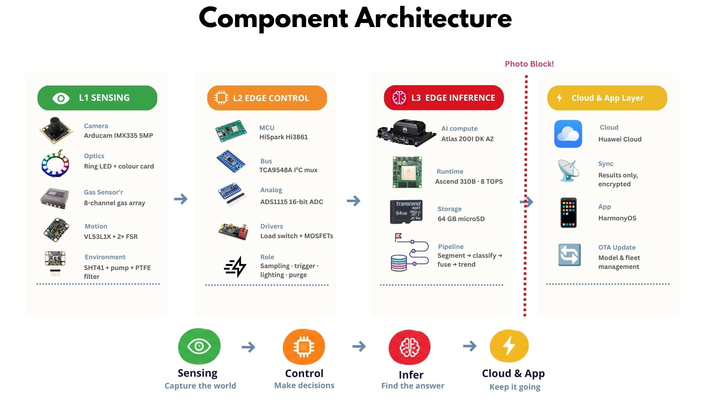
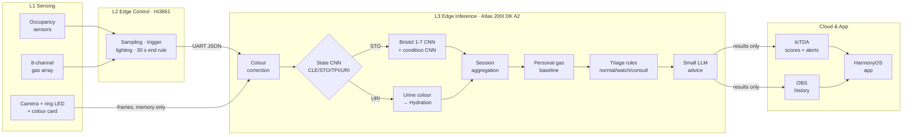

<div align="center">

# 🚽 PeekaPoo

### AI-Powered, Non-Contact Gut Health Advisor

*Turning gut-health monitoring from a habit you have to keep into something that simply happens.*

[](#)


<br>


**Team InsideOut · Universiti Sains Malaysia**

[Highlights](#-highlights) · [Architecture](#-architecture) · [Quick Start](#-quick-start) · [Small LLM](#-the-small-llm-advisor) · [Dataset](#-dataset) · [Training](#-train--deploy-the-vision-models) · [Roadmap](#-roadmap)

</div>

---

> [!IMPORTANT]
> PeekaPoo is a wellness **screening** aid, **not** a diagnostic device. Every risk decision is made by
> fixed, reviewable rules ([`peekapoo/scoring.py`](peekapoo/scoring.py)); the language model only rewords them.

## ✨ Highlights

<table>
<tr>
<td width="50%" valign="top">

### 🔒 Privacy by design
Frames live **only in memory** on the Atlas and are discarded after inference. Nothing but an explicit
allow-list of results ([`CLOUD_FIELDS`](peekapoo/cloud_sync.py)) ever reaches the cloud.

</td>
<td width="50%" valign="top">

### 🧠 On-device AI cascade
Toilet state → Bristol Stool Scale (1–7) → gut condition, running on the Ascend NPU, plus urine colour
→ Hydration Score with colour-card correction.

</td>
</tr>
<tr>
<td width="50%" valign="top">

### 📈 Personal baseline
Gas readings are scored against **your own** history (robust z-score) and only alert after a
**3-day** persistent deviation, so a one-day diet spike never triggers a false alarm.

</td>
<td width="50%" valign="top">

### 💬 Guarded small LLM
A 0.5B-parameter model explains results in plain language and answers questions, behind
guardrails: no diagnoses, no invented numbers, and emergencies bypass the model.

</td>
</tr>
</table>

## 🏗 Architecture

<div align="center">

</div>

### How a toilet visit is processed



## 📁 Project Structure

```
PeekaPoo-system/
├── run_edge.py               # entry point on the Atlas (real hardware or --simulate)
├── peekapoo/
│   ├── config.py             # all settings, overridable with PEEKAPOO_* env vars
│   ├── sensor_link.py        # UART link to the Hi3861 (+ hardware simulator)
│   ├── camera.py             # in-memory frame capture
│   ├── color_correction.py   # colour-card correction (3×3 CCM, gray-world fallback)
│   ├── classifiers.py        # state / Bristol / condition CNN cascade (torch or .om)
│   ├── urine.py              # urine colour → Hydration Score
│   ├── gas_baseline.py       # personal baseline + persistence-based anomaly detection
│   ├── session.py            # per-visit aggregation
│   ├── scoring.py            # Digestive Score + deterministic triage rules
│   ├── llm_advisor.py        # small LLM advisor with guardrails
│   ├── store.py              # local SQLite history & offline sync queue
│   └── cloud_sync.py         # Huawei Cloud IoTDA (MQTT) + OBS
├── hi3861_firmware/          # OpenHarmony firmware for the Hi3861 edge controller
├── training/                 # training, ONNX export, ATC → .om conversion
├── dashboard/                # local Flask dashboard with AI advisor card
├── tools/                    # demo-data seeding
└── docs/                     # figures
```

## 🚀 Quick Start

Runs on any PC with **no hardware**: a simulated Hi3861 plays a toilet visit and sample images stand in for the camera.

```bash
pip install -r requirements-dev.txt

# create 14 days of synthetic history so the baseline and alerts can be demonstrated
python tools/seed_demo_history.py --user user1 --days 14                              # healthy
python tools/seed_demo_history.py --user user2 --days 14 --scenario constipation_gas  # 3 bad days

python run_edge.py --simulate --once                                  # one normal visit (user1)
python run_edge.py --simulate --once --user-button 2 --gas-boost 3    # anomalous visit (user2)
python dashboard/app.py                                                # → http://localhost:8000
```

> [!NOTE]
> Without trained models the classifiers are **random placeholders** (a warning is printed): the pipeline
> runs end to end, but the labels are meaningless until you [train](#-train--deploy-the-vision-models).

## 💬 The Small LLM Advisor

| | |
|---|---|
| **Model** | Qwen2.5-0.5B-Instruct (Apache-2.0), 4-bit GGUF ≈ 0.4 GB |
| **Runs on** | Atlas 200I DK A2 ARM CPU via `llama-cpp-python`; the NPU stays free for the CNNs |
| **Does** | Writes 2–3 sentences + tips after each visit; answers follow-up questions via `/api/ask` |
| **Sees** | Structured numbers only: never images, never raw sensor data |
| **Fallback** | No model file or a failed check → deterministic template, so the device always works |

**Guardrails**, in [`llm_advisor.py`](peekapoo/llm_advisor.py):

1. The risk level comes from `scoring.triage()` and is passed in as fixed: the LLM cannot raise or lower it.
2. `check_output()` rejects diagnoses, drug names/doses, numbers not present in the data, and missing clinician advice when the level is *consult*.
3. Emergency terms (blood, black stool, severe pain…) skip the LLM entirely and return a fixed "seek medical care" message.
4. The medical disclaimer is appended by code, never generated.

```bash
pip install -U "huggingface_hub[cli]"
huggingface-cli download Qwen/Qwen2.5-0.5B-Instruct-GGUF qwen2.5-0.5b-instruct-q4_k_m.gguf --local-dir models
export PEEKAPOO_LLM_BACKEND=llamacpp
```

## 🗂 Dataset

Our dataset is partially hosted on Google Drive:
**[📥 PeekaPoo dataset (Google Drive)](https://drive.google.com/file/d/1aVG-MeGbs6UDDamuYg-NkCbmNdBAvjhE/view?usp=sharing)**

Download it and arrange it as one folder per class before training:

| Task | Folders |
|---|---|
| `state` | `CLE` (clean) · `STO` (stool) · `TPI` (toilet paper) · `URI` (urine) |
| `bristol` | `BS1` … `BS7` |
| `condition` | derived from `BS1`–`BS7` with `--from-bristol` (1–2 constipation, 3–5 normal, 6–7 diarrhoea) |

## 🏋 Train & Deploy the Vision Models

```bash
# 1. train (locally or in a ModelArts notebook)
python training/train_classifier.py --task state     --data-dir DATA/state
python training/train_classifier.py --task bristol   --data-dir DATA/bristol
python training/train_classifier.py --task condition --data-dir DATA/bristol --from-bristol

# 2. export to ONNX
for t in state bristol condition; do python training/export_onnx.py --task $t; done

# 3. on the Atlas: ONNX → Ascend .om, then run on the NPU
bash training/convert_om.sh
export PEEKAPOO_VISION_BACKEND=om
python run_edge.py
```

## ⚙ Configuration

All settings live in [`peekapoo/config.py`](peekapoo/config.py) and can be overridden with `PEEKAPOO_<NAME>` environment variables.

| Variable | Purpose |
|---|---|
| `PEEKAPOO_SERIAL_PORT` | UART port of the Hi3861 link |
| `PEEKAPOO_VISION_BACKEND` | `torch` (PC) or `om` (Ascend NPU) |
| `PEEKAPOO_LLM_BACKEND` | `llamacpp`, `transformers` or `template` |
| `PEEKAPOO_IOTDA_HOST` / `_DEVICE_ID` / `_DEVICE_SECRET` | Huawei Cloud IoTDA device credentials |
| `PEEKAPOO_OBS_SERVER` / `_BUCKET` / `_AK` / `_SK` | Huawei Cloud OBS storage |
| `PEEKAPOO_DB_PATH` | local SQLite history |

> [!WARNING]
> Never commit AK/SK or device secrets. Set them as environment variables on the device.

## 🔄 Built on PHIND

PeekaPoo started from the open-source **[PHIND system](https://github.com/szq1223/PHIND-system)**
(Nature Protocols, 2026) and re-architects it around an edge-first, privacy-first design on Huawei hardware.

<details>
<summary><b>File-by-file comparison with PHIND</b></summary>
<br>

| PHIND | PeekaPoo | Change |
|---|---|---|
| Step 34/35/36 ADC, pressure, LED tests; Step 74 `pressure_sensor.py`; Step 75 `led_control.py` | `hi3861_firmware/peekapoo_ctrl.c` | Low-level sensing moves from the Raspberry Pi to the Hi3861 (OpenHarmony). Same 30 s end rule; adds the 8-channel gas array and a user button. |
| Step 76/77 fingerprint enrolment/sensor | Hi3861 user button → `{"t":"uid"}` | Fingerprint scanner removed; per-user baselines use a user-select button (or the app). |
| Step 74 `main.py`, `cleanup.py`, `plot_graph.py`, `PHIND_run.sh` | `run_edge.py`, `peekapoo/sensor_link.py` | One process on the Atlas; `--simulate` mode runs without hardware. |
| Step 77 `image_capture.py` (libcamera → JPEG files) | `peekapoo/camera.py`, `peekapoo/color_correction.py` | Frames stay in memory; colour-reference-card correction added. |
| Step 77 `s3_upload.py` (all raw images → S3) | `peekapoo/cloud_sync.py` | Results only → Huawei Cloud IoTDA + OBS; offline queue in SQLite. |
| Step 121 Lambda (S3→SQS→SSM→EC2, regex on stdout) | `peekapoo/classifiers.py::GutAnalyzer` | Same 4-class → (7-class + 3-class) cascade, run in-process on the NPU (`.om`) or CPU (`.pt`). |
| Step 128 `analyze_{3,4,7}class.py` | `peekapoo/classifiers.py` | Models loaded once; torch or Ascend `.om` backend. |
| Step 65/66/67 training scripts | `training/train_classifier.py` | One script. Fixes: un-augmented validation, per-class strong augmentation, per-sample focal loss, correct class order, state_dict saving. |
| — | `training/export_onnx.py`, `training/convert_om.sh` | ONNX → ATC → `.om` for the Ascend 310B. |
| Step 130 Django app + DynamoDB | `peekapoo/session.py`, `peekapoo/store.py`, `dashboard/` | Session aggregation on the edge; Flask dashboard with Chart.js + AI advisor card. |
| — | `peekapoo/urine.py` | **New**: urine colour → Hydration Score. |
| — | `peekapoo/gas_baseline.py` | **New**: personal baseline & two-stage anomaly detection. |
| — | `peekapoo/scoring.py` | **New**: Digestive Score, deterministic triage rules. |
| — | `peekapoo/llm_advisor.py` | **New**: small LLM advisor with guardrails. |

</details>

## 🗺 Roadmap

- [x] End-to-end simulated run on PC (placeholder models, template advice)
- [x] Training script smoke-tested on the PHIND sample images
- [ ] Train real models on our dataset; report accuracy on a held-out test split
- [ ] Verify ONNX → `.om` conversion and `ais_bench` inference on the Atlas
- [ ] Build `llama-cpp-python` on the Atlas, measure LLM latency / RAM
- [ ] Flash and tune the Hi3861 firmware (pins, pressure threshold, gas ADC)
- [ ] Calibrate `URINE_CHART_RGB` and colour-card patch boxes on our actual toilet
- [ ] IoTDA product model (service `GutHealth`) + HarmonyOS app subscription

## 🙏 Acknowledgements

- **PHIND system**: *Deployment of a cloud-based passive defecation monitoring system for continuous gut health monitoring*, Nature Protocols **21**, 3068–3097 (2026). [DOI](https://doi.org/10.1038/s41596-025-01296-9) · [Code](https://github.com/szq1223/PHIND-system)
- **Qwen2.5** by the Qwen team (Apache-2.0)
- Built for the **11th Huawei ICT Competition, Innovation Track**

<div align="center">
<sub>Made with 💩 and ❤️ by Team InsideOut</sub>
</div>
